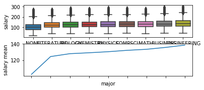
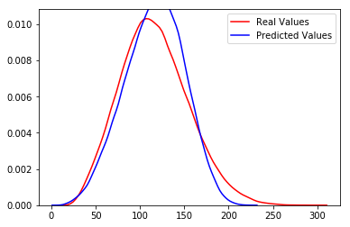

# salarypredictionportfolio
**Salary Prediction Project (Python)**
# Salary Predictions Based on Job Descriptions #

**Introduction:**

We have three dataset train features, train salary and test features trying to predict the salary for the test features dataset according to the relation between the independent variables provided in the train features dataset that are job Id, company Id, job Type, degree, major, industry, years of experience and miles from metropolis and the target variable which is salary.

**Procedures:**

Using Ubuntu and Python first we load the data to Jupiter Notebook and check them there was a million record in each dataset. Merging the train features with the train target in one dataframe. In the new dataset there was no duplicate records, but we removed the five records with zero salaries which wasn’t logical since there is no indicator they are working in a nonprofit organization.

**Data visualization:**

The target distribution was almost normally distributed and there was some values looks like they are a outliers, but when we checked them closely they were reasonable and acceptable as shown below:

There was a reasonable correlation between most of the features and the target except the job Id which was unique, so we drop it. The bellow graphics shows the relation between companyId, jobType, degree, major, industry, yearsExperience and milesFromMetropolis and the target variable salary respectively:

After separating the categorical variable from the numerical once, we code them with dummy variables and rejoined them again in one dataframe. Separating the new dataframe to 75% train data and 25% test we ran multiple linear regression, random forest regression and gradient boosting regressor models on the train data and then we apply them on the test data and the prediction and the actual values shown in the curves below for three of then respectively:

**Result and conclusion:**
After applying the gradient boosting regressor which have the minimum sum of square mean between the three models, we apply it on the original test set. When we ran the feature importance’s test we find that the year of experience is the effective feature then the miles from metropolis and so on as shown below.

